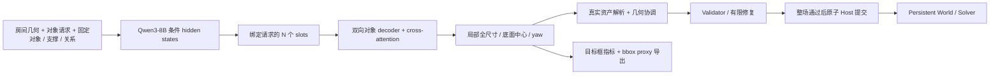

# FastFill v2：多源条件、连续几何监督与资产闭环

日期：2026-10-06。用户完整设计是 **房间几何＋对象请求＋固定对象／支撑／关系条件 → 连续几何 heads 预测目标框 → 实际资产解析与几何协调 → 验证／有限修复 → 原子 Host 提交**。结构化监督从连续 heads 反传，Hungarian 只用于合法可交换组。新主数据保留原多源语料与完整条件；三字段 `reference_extent` 视图是独立的简化输入消融，不替代主方案。

## 1. 训练和推理 pipeline

FastFill 学习 A→E。几何损失直接对预测张量反传，不依赖先生成 JSON 再解析。F→H 是实际资产和提交闭环；目标框正确、bbox proxy 通过、真实 mesh/physics/Host 可用是不同验收范围。代码里的 memory Host 不等于真实 WorldEdge Host，框级 Validator 不能认证所有真实接触或穿透。截图 `REFERENCE / Input layout` 是 RoomGenBench 的 `layout_boxes`，直接显示给定框，不能当作模型生成质量或部署闭环证据。

用户已明确最终下游是 **RoomGenBench**。其实际接口是每对象 text＋target bbox＋位姿到生成 mesh，Asset Resolver 在本任务中应解释为资产生成／选择适配层。RoomGenBench 原装配器会非均匀 fit mesh 到目标框；使用该策略时必须保存原生和拟合后尺寸、变换与 sidecar 状态，并单列为 benchmark 装配政策，不能称为未缩放资产检索成功。`failed` 的灰盒与 `fallback` 代理不计作成功生成的家具。详见 [本轮设计审核](fastfill-v2-design-audit-20261006.md)。

主条件保持父数据的房间多边形／高度／地板资格、已有固定物体、对象描述与可用尺寸条件、支撑引用和关系约束。未来目标尺寸／位置／yaw 不注入条件；合法的固定物体几何仍是条件。未知信息保持未知，不为了通过诊断统一修改已知房界或地板。缺少真实高度时协议参考尺度不等于观测天花板。

简化输入消融另外使用 `request_to_condition(..., room_size_semantics="reference_extent")`，输入只有 room type、room size、furniture list。房间尺寸是源房间 XY 参考范围，不宣称真实矩形边界；Z=0 是名义坐标参考，boundary/floor known 均为 false。其推理需显式 `--request ... --room-size-semantics reference_extent`；完整主条件使用 `--condition` 中原有资格字段。默认 `rectangular` 保留明确矩形请求行为。简化视图的 scene、RoomGenBench handoff 和 diagnostics 保留参考范围／未知物理资格，未知 physical checks 返回 unknown。接口和轴转换见 [直接 bbox 交付手册](fastfill-v2-direct-bbox.md)。

### 与 OptiScene 的区别

| 环节 | OptiScene 原任务 | 当前 FastFill v2 |
|---|---|---|
| 模型输入 | 房间、对象描述/数量、已检索资产 bbox | 房间、请求对象、已有固定物体、可用支撑／关系；未来目标几何不作条件 |
| 模型输出 | 位置和旋转 | 目标局部全尺寸、底面中心、yaw |
| 训练 bbox | 作为生成位姿的条件 | 可靠 local size 放在 target，参与几何监督 |
| 后续 | 渲染既定资产 | 目标框先评测，再进行实际资产解析、几何协调和整场原子提交 |

[OptiScene §3.1、§3.3](https://arxiv.org/html/2506.07570v1#S3.SS1) 和固定数据 revision 的 [gprompt.py](https://huggingface.co/datasets/B3rrYang/3D-SynthPlace_indoor_scenes_dataset/blob/f481ff81bc2cb3e664f38ce0c25c4ad4b21d52e1/gprompt.py) 表明其 bbox 在 input，output 为 coordinates/rotate。将 bbox 移到预测端改变了任务和监督，不只是移动 JSON 字段。

最小文本改法是移除输入 bbox，在目标 JSON 增加 size；v2 文本 SFT 是这个对照。结构化主模型还更换输出架构和训练方式，不是原 OptiScene SFT/DPO 的原样复现，也没有自动 DPO 阶段。原 3D-SynthPlace 的 Y-up、bbox=[h,w,d] 与 degree 字段需要已审计的适配，不能直接作为 Z-up、局部尺寸、bottom-center/radian 标签。

[OptiScene 论文 §4.1](https://arxiv.org/html/2506.07570v1#S4.SS1) 使用 Qwen3-8B，[官方 README](https://github.com/PolySummit/OptiScene#training-pipeline) 示例则是 Qwen2.5-7B-Instruct；本实验按用户选择固定 Qwen3-8B。官方环境列 vLLM，但其 SFT/DPO 和 model.generate 推理代码未调用；当前结构化路径也不需要它，来源见 [服务器手册](fastfill-v2-server-start.md)。

## 2. 数据如何构造

当前主实验是 `multisource-20261006`，从 review3 的 141,341 场景父语料派生保留完整条件的主数据，延续 Excel 的原选定 **16 个家族体系**。其中 11 个产生训练房间的家族展开为 16 个训练 source tags；SceneSmith、SpatialGen 两个家族保持只评测；3D-FRONT、3RScan、ARKitScenes 三个家族承担房间／分组等辅助用途。16 个家族不等于把 16 个家族全部放入 train。原 UID、房屋／分组和 train/validation/test 不重新随机划分。

原 `direct-bbox-20261006` 是保留的 SpatialLM 单来源 pilot，其 builder 在几何检查前使用了 source 白名单。因此“其他来源不满足最小输入，只有 SpatialLM 天然合格”不是这份数据支持的结论。这个 pilot 用完整几何和真实矩形资格做严格对照，不能替代多源主实验。原完整 65 场景 cohort 全来自 MultiScan，也不能代表整个多源语料或物理验收通过的房间。

| 数据 | train / validation / test | 对象总量 |
|---|---:|---:|
| 历史 SpatialLM 最小 XY pilot | 9,601 / 539 / 624 | 33,545 |
| 保留的历史 review3 主数据 | 124,589 / 8,137 / 8,615 | 1,787,052 |
| 保留的历史完整标签 cohort | 57 / 2 / 6 | 572 |

新多源主数据已完成：124,589 / 8,137 / 8,615 场景，目标数值保留，D1/D2 与交换资格降级后有效 position / size / semantic yaw 为 1,732,188 / 1,224,657 / 581。真实 Qwen tokenizer 预检后的实际资格视图为 124,375 / 8,125 / 8,602；全量行数、旧版过滤差额和服务器证据见 [2026-10-06 完成记录](fastfill-v2-multisource-20261006.md)。原文件行数与默认训练过滤后资格是不同口径。

主数据派生遵循以下规则：

1. **保留完整条件**：保留父 room、fixed objects、对象请求、support 引用和 constraints；exchangeable groups 必须在新 mask 下重新确认合法。关系条件是主任务的一部分，不能通过删去它们证明主任务完成。未来目标几何和 provenance 中的资产身份不注入条件。
2. **保持数值标签**：主视图不进行 XY/Z 平移、尺寸修补或 yaw 补零。target 的尺寸、位置、yaw 数值保持父记录原样，改变的是有证据不足／可表达范围问题的资格字段。逐条记录变更、父数据和输出 hash。
3. **保留部分监督**：每条数据仍含 condition、target、validity、provenance。位置、尺寸、yaw 使用各自已有证据和 mask，缺少 yaw 的来源仍能监督可信 position/size；未知标签不会补成有效的零值。模型只读 condition，source evidence 不从 provenance 注入输入。
4. **Scan2CAD 保守资格**：其冻结 IR 的地板估计／上游贴地不能重新解释为测得的真值。仅对该来源将 floor_known 设为 false，并记录 estimated floor 来源；保守屏蔽整个 position 向量，保留有效尺寸等独立监督。不恢复缺失的贴地前 raw Z，不改 target XY/Z/size。现 loss 按完整 position 向量判断资格，这个策略没有冒称已实现逐坐标学习。
5. **默认 size head 范围**：审计发现 13 个原全有效 size 对象有轴超出默认 `exp(-10)` m 下限。新视图屏蔽这些对象整个 size 向量并保留原值／变更理由，不用统一 epsilon 伪造家具厚度，也不修改其他有效 target。薄于 1 mm 或 5 mm 的候选不因诊断计数自动全部失效。
6. **yaw 证据**：主视图维持父语料 581 个有效 semantic yaw（train/validation/test 为 523/21/37），不提升 SpatialLM geometric bbox-axis yaw，不把矩形轴等价旋转当成语义正面。其余缺失 yaw 继续屏蔽；已可信 position/size 不因此全部丢弃。

Hungarian 是否启用必须与主条件内实际合法可交换组一起冻结。一般支持只有在类别、描述、几何条件、支撑和关系角色均允许交换时才成立；不跨合法组把身份或角色错配。对象数／context 预算是入训资格，不能把 SpatialLM pilot 的最多 26 个对象写成新主语料的上限。

D1/D2 的 mask 降级也会影响组资格：若某一组任一成员缺少完整有效 position 或 size，整个组所有成员都移除 `exchangeable_group` 标记，按设计 §3.2 回到固定身份对应，而不是继续使用证据不足的 Hungarian 代价。实际例为 `Scan2CAD::scene0043_01` 的原合法组在 D1 position 降级后不再具备完整几何监督。每个被移除标记的成员均记入变更清单；ID、请求顺序、support、relations 和 target 数值保持原样。因此主 condition 不能表述为除 floor 字段外逐字不变，而应按逐条变更记录核验完整条件与组资格的保留。

独立的 `data-minimal-reference` 消融视图才将源房间低 XY 角平移到原点，并对 target bottom-center 做同一 XY 平移，Z 原值不变；尺寸／原 yaw 不因平移改变。房间 reference extent 从父房间条件计算，缺少房型证据写 unknown，不输入固定物体、约束或支撑。它保留 partial masks 和 D1/D2 保守政策，初版另有 SpatialLM 几何轴 yaw 提升，π 周期 `symmetry_order=2`，并继承 MultiScan 原严格 yaw；这项几何轴政策不属于主数据的 semantic yaw 协议。消融的碰撞／支撑／mesh／physics 也未认证。

主输出已生成于本仓库 `outputs/fastfill_v2/multisource-20261006/data`、独立外盘包 `/Volumes/harddisk/FastFill_v2_multisource_20261006` 和服务器 `/home/jovyan/shanliantian/FastFill_v2_multisource_20261006`；简化消融为本地和外盘的 `data-minimal-reference`。主数据与消融均独立逐行验证，通过最终报告保存变更和 hashes，未覆盖 review2/review3、历史 pilot、源 IR 或 checkpoint。源审计和 hash 正确仍不能证明模型已经学会有效布局。私有历史下载与版本见 [数据手册](fastfill-v2-dataset-release.md)；本段没有声称已经公开发布新包。

## 3. 一次 forward 联合预测什么

Qwen3-8B 使用 AutoModel 读取完整 condition、输出全部 token hidden states，不读取目标答案，也不生成 thinking 文本。每个对象 token 区间 pooling 构造 request-bound slot，并加入 slot seed；pooling 至少使用 float32 累加。外部 decoder 在所有有效 slots 间双向 self-attention，并 cross-attend 条件记忆；padding 在 attention、matching 和 loss 中屏蔽。

| head | 输出 |
|---|---|
| position | normalized XYZ bottom-center，用输入房间原点/尺度反归一化；`model.position_head=grid_residual` 时 XY 为 16×16 格 logits＋每格 tanh 残差（取 argmax 格＋该格残差解码），z 仍回归 |
| size | 正值 s_ref × exp(clamped_u)，指数 float32 计算，数值策略固定在配置 |
| yaw classification | 12 个 bin logits，初始宽度 30 度 |
| yaw residual | 每个 bin 的归一化 residual；默认 tanh |

每个请求 ID 恰好一个有效输出，不再预测类别/数量，没有 objectness、检测分类或 NMS。主条件的 support_parent 和固定信息按已有证据使用，固定坐标有独立预测 mask；不按家具类别凭空强制 z=0。XYZ 均可预测，只有具备有效完整 position 向量且仍需学习的目标接受该项监督。

一次 forward 同时生成全部对象，不保证结果可行。目标框可以先做不改预测的 bbox 导出和独立评测；主资产运行时则解析真实尺寸、协调几何、执行验证和有预算的修复。保存原预测、协调后结果和提交状态，避免把修复或丢弃请求后的分母当成原模型能力。

## 4. 每个训练 step 怎么执行

1. **取完整 batch**：schema、实际启用 loss、token/object 预算预检；超预算拒绝整场景，不截断。当前 DataLoader 内存载入、shuffle，无稀有标签平衡 sampler。
2. **forward 和对应**：请求 ID 绑定对象 slot；可选合法独立交换组内 detached position/log-size Hungarian。是否启用以及实际合法 groups 数量写入正式实验配置，不能用无约束全局匹配取代关系角色对应。
3. **四项 loss**：normalized position SmoothL1、log-size ratio SmoothL1、yaw-bin CE、GT-bin residual SmoothL1。先过滤无效标签再算术；loss 使用原可微张量。位置/尺寸完整向量按固定三坐标分母平均，各 head 使用自己的全局有效实例数。已有合法旋转等价标签按同一个候选的 CE+residual 联合代价选择，不在主 semantic yaw 上统一引入 π 等价。
4. **更新**：backward → LoRA/decoder/heads → 累积 → clip → AdamW。所有 rank 整个累积窗口没有有效 objective 时跳过更新；有监督但 loss=0 仍正常更新。日志 collective 输入统一 float32，训练张量保留梯度；validation 在 optimizer 更新后执行。
5. **保存和评测**：保存权重、tokenizer、配置、数据 hash、拒绝清单、每步 loss/计数/梯度。测试以全部请求为分母保留失败；原始预测与任何另行后处理结果分开。

训练日志 loss/count 来自累积窗口最后 microbatch，并非窗口均值；window 有效数另记录。累积为 microbatch 均值的累积，不等于不同标签密度的全对象平均。validation batch-objective 均值是诊断，完整参考指标由 evaluate 得到。

基础配置 box/collision/boundary 权重均为零；可选 box 为 BEV oriented convex-hull GIoU，不是 3D GIoU，bin argmax 不给 logits 普通梯度。collision/boundary 与 prediction-vs-GT overlap 分开。没有自动阶段切换。

文本 SFT 是同条件视图上的独立 assistant-token CE baseline。使用它比较多源主实验前，要另冻结完整目标子集或明确缺失字段协议；不能把 partial masks 抹去后将未知几何写成可信答案。字符串解析后的几何误差不自动回传到 token。主方案无需文本模型预训练或 DPO。结构化按 shuffled epoch、文本每步有放回抽样，相同步数不自动等于相同样本曝光，应在正式对照冻结。

## 5. 最后得到什么

| 工件 | 用途 |
|---|---|
| model/model_config.json、geometry_model.pt | decoder、连续 heads 和配置 |
| model/backbone/ | LoRA adapter 或选定的完整骨干；LoRA/冻结骨干部署仍需同一基础 Qwen |
| tokenizer/ | 同训练的 tokenization |
| run_manifest_start.json | 第一次更新前写出：config、数据／验证／实现 sha256、骨干路径＋HF snapshot revision＋config.json sha256、tokenizer sha256、增广、world size、实际入训／验证／minimal 投影样本数、选模指标 |
| run_manifest.json、training_log.json | 数据/配置/环境/有效样本和优化证据；`selection_metric.best` 给出最佳验证 step |
| model*/checkpoint_manifest.json | 每个导出绑定的 step、max_length、数据／配置／实现 hash；evaluate／predict 据此读取 max_length |
| state-step-* / model-step-* | 每个 checkpoint 的 Accelerate 恢复状态与可部署导出；`--resume <state-step-n>` 在新输出目录继续 |

部署模型生成 target_size_local_m、bottom_center_m、yaw_rad；export_handoff 再生成 bbox corners/center、RoomGenBench SceneSpec/registry、彩色 GLB、SVG 和 proxy diagnostics。不需要资产库即可显示用户截图那类框。真正家具 mesh、材质和物理可用性由下游负责，不能由 bbox 输出成功推断。

catalog Resolver、actual geometry reconciliation、Validator／有限修复和 Host 组成主部署闭环。包内离线 catalog、随机 tiny 权重和 in-memory Host 的可执行回归证明代码行为，真实资产、mesh／physics／Solver 与 WorldEdge Host 仍需独立接入验收；没有实际执行就不能写为已经通过。

当前实现还有明确的接入缺口：`validate_scene` 对 mesh、physics、solver 三项始终返回 unknown，尚未连接实际 checker 或接收外部验收证据；设为 required 后会阻断。Host 只有协议和 `AtomicMemoryHost` 离线实现，尚无真实持久化 WorldEdge Host adapter。已有 fail-closed 行为不等于这些真实 driver 已实现。非空门窗 clearance 和经过验证的颜色／材质属性同样没有当前可通过的证据合同。

## 6. 当前训练状态与执行入口

此前已核验 ssh yxd-dev 的 /home/jovyan/shanliantian 上的独立 Conda、官方固定 revision Qwen3-8B 和 CUDA。基础模型路径为 models/Qwen3-8B；revision b968826d9c46dd6066d109eabc6255188de91218。用户允许 GPU 1–7，其他进程和 GPU0 保留。这个环境记录不能代替新多源包的同步 hash、服务器当前资源检查和真实 tokenizer 全量 preflight。

历史 richer-condition MultiScan pilot：20 更新步、两个 train/两个 validation，所有 LoRA/decoder/四 head 每步收到梯度，保存加载后六个测试 schema/ID/正尺寸均通过；验证 objective 未改善，严格几何0/6主要含未知硬检查。这证明历史运行路径，不证明新多源主模型已训练或泛化，更不能当作密集房间生成效果。

当前主执行顺序是：新 full-condition build 与独立逐行追溯 → 真实 Qwen tokenizer 的全量 context/object/loss 资格预检 → 冻结实际入训 manifest、source 分布和有效 yaw 曝光 → 独立 tiny smoke → 同一 Qwen3-8B 有界 pilot → 冻结正式预算、合法交换组和采样策略 → 全请求目标框评测 → 真实资产闭环验收。`max_objects=128` 和实际 context 长度可能排除部分完整场景，排除必须保留明细，不能静默截断或把构建场景数当成实际入训数。服务器环境可用、tiny 路径通过和数据 hash 一致各证明一部分；全量训练启动与模型质量验收需要分别记录。

本轮真实 tokenizer 全量预检、Qwen 单卡四更新、七卡通信与七 rank Qwen 有界更新均已完成。实际七 rank prepared loader 核验后，均匀三轮候选为 3,333 updates；B1/K16 为更保守的显存候选，不能把 B2/K8 的 microbatch 均值权重称为完全相同。七卡完整预算还未启动；2026-10-06 起 CLI 支持 `--resume`。

父 validation/test 没有显式关系约束；新的 13,969 场景 heldout NEAR 正例视图已冻结且独立全量验证，是参考布局派生的独立评测视图，尚未执行真实 tokenizer 资格或模型评测，也不覆盖所有关系类型。train semantic yaw 仍仅 523 对象 / 58 场景；均匀三轮只是有限标签曝光基线，需要记录实际有效窗口并按 yaw 子集单报指标。普通均匀采样不自动保证朝向学会。完成证据和具体下游兼容缺口分别见 [多源记录](fastfill-v2-multisource-20261006.md) 与 [RoomGenBench 接口审核](fastfill-v2-roomgenbench-interface-20261006.md)。

新的主运行保存新 full-condition 数据 hash，通过 `--condition` 使用原条件；三字段消融另用 `reference_extent` profile 和自己的 manifest／checkpoint。历史 rich-condition MultiScan 和 SpatialLM-only pilot 记录保留，不将它们改称新多源主实验。完整标签 cohort、bbox proxy 和下游彩色框展示均不能代替真实资产／物理／Host 的最后验收。

## 7. 2026-10-07 第二轮：正式运行与选模

正式运行改为两组并行，替代上面的七卡 B1/K16 候选：

| 配置 | 进程 × batch × 累积 | 位置头 | 更新数 | warmup | 验证／保存 |
|---|---|---|---|---|---|
| `qwen3_8b_main_4gpu_regression.json` | 4 × 1 × 24 | regression | 3,887 | 117 | 每 500 步 |
| `qwen3_8b_main_3gpu_grid.json` | 3 × 1 × 32 | grid_residual | 3,887 | 117 | 每 500 步 |

两者全局 batch 都是 96，3,887 = ⌈3 × 124,375 / 96⌉，即 124,375 个入训场景上的 3 轮；其余设置与 `qwen3_8b_main_world7.json` 逐键相同（max_length 8192，yaw_reg 封顶 2.0，grid 权重 position_cell 0.04／position_residual 0.4，minimal_form_p 0.5）。`--nproc_per_node` 必须分别为 4 和 3，否则全局 batch 不是 96。训练器自己的 preflight 现在按 8192 token 过滤，启动后先看 `run_manifest_start.json` 的 `supervised_samples`；不等于 124,375 时，按 `steps=⌈3N/96⌉`、`warmup=round(0.03·steps)` 另写配置。启动命令和数据重建顺序见 [v2 README 的 round 2 一节](../fastfill/v2/README.md#2026-10-07-round-2) 与 [服务器启动](fastfill-v2-server-start.md)。

本轮训练侧变化：

- **盒对称（K1）**：`validity.size_axis_swap_allowed` 为真的对象，标注框也可以写成 (sy, sx, yaw+π/2)。loss 在 k∈{0,1,2,3}（yaw+kπ/2，奇数 k 交换 xy 尺寸）中按 size＋yaw CE＋yaw 残差的 detached 联合最小选择候选；匹配的 log-size 代价取两种轴序的较小值；评测对这些对象报告盒等价误差，并另报 `*_plain_convention`。
- **三字段输入（K5）**：增广 `minimal_form_p`（默认 0.5）只对 1 cm 内的轴对齐矩形且 `boundary_known` 不为 false 的房间生效（`batch.minimal_form_eligible`；hull 和 `reference_extent` 矩形不会被改写成已知边界），把条件换成 `batch.render_minimal_condition`（房型、外包矩形、物品清单），重新分组，该样本的地面固定 z 改为学习。默认 rectangular 请求经 `direct_layout.request_to_condition` 渲染出的文本与之逐字节相同。
- **grid 位置头（K7）**：格 CE＋GT 格残差 L1＋z 的回归份额；`predictions["position_normalized"]` 总是解码给出，匹配、正则、评测和交付不受位置头类型影响。窗口日志另含 `position_cell`／`position_residual`／`position_z`。
- **周期验证与选模**：每次验证同时跑完整条件和边界已知的矩形房间上的三字段投影（`evaluate.project_minimal`）；最后一次更新也一定验证并保存（间隔为 0 时除外）。选模指标 `validation.minimal.collapse.score` = minimal 投影上预测框的 BEV 重叠率（IoU>0.3）＋ 落在中心四分之一的比例，越低越好。该分数没有精度项，GT 标签在同一投影上的分数记在 `selection_metric.ground_truth`，预测分数低于它只说明比数据更分散，应结合 `validation.minimal.unweighted` 的位置误差阅读；`run_manifest.json` 的 `selection_metric.best.step` 指向对应的 `model-step-<n>`（正式配置的验证与保存间隔相同）。不得用 test 选模。
- **启动绑定（K8）**：`run_manifest_start.json` 在第一次更新前写出；`--expect-data-sha256`／`--expect-validation-sha256` 不匹配时在产生任何输出前中止。evaluate／predict 默认从 checkpoint 读取 max_length 和模型设置，显式参数优先；`evaluate --projection full minimal` 同时报告两种投影。
- **校验三态（K10）**：`validate_scene` 每项检查为 pass／violation／unknown（原 fail 改为 violation），另给 counts；ok 的语义不变。evaluate 按检查项统计三态；带 `provenance.height_conflict` 的行，其 ceiling 检查单独计为 `ceiling_on_height_conflict_rows`。
