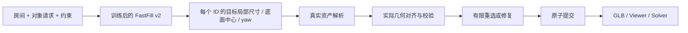

# FastFill v2：从训练数据到完整房间

日期：2026-10-06。本文说明当前代码实际完成的路径、训练产物和仍需实验确认的部分。模型接口采用 2026-10-05 设计；本次修复不把未运行的 Qwen 训练或真实资产验收写成结果。

## 1. 最终要得到什么

目标是输入房间、指定对象清单和约束，得到一间可用、可显示、可提交的完整房间。FastFill 学习的是其中的**目标尺寸与布局**；家具 mesh、贴图、能力和真实支撑面来自后续资产系统。

RoomGenBench 的 `Input layout` 是已经给定的参考位置、尺寸和旋转，其 benchmark 主要比较这些框如何变成 mesh。`sage_gt` 还直接使用数据集自身的原始资产。它的普通 assembler 会沿三个轴缩放 mesh 到给定框；这不能用于证明我们要求的真实尺寸匹配率或功能保持。

我们要学习图中 B→C，再把它与 D→H 接起来。可以参考 RoomGenBench 的 GLB、共享 mesh 和可视化方式；不能把参考布局直接喂给模型，随后称模型生成了布局。具体只读代码审查见本次 `audit/review2/roomgenbench-comparison.md`，当前仓库证据在 `outputs/fastfill_v2/review-20261006/`。

## 2. 数据来自哪里，为什么要新建版本

继续使用我们筛选的 **16 个数据集家族**，没有另换一套训练库。读取冻结 `.release/v3.2` IR、原划分和审计证据，转换为新的 v2 数据。原始 `/Volumes/harddisk/3D_Room_Collections`、旧 release 和旧上传包保持不变。

| 数据范围 | train / validation / test 场景 | 用途 |
|---|---|---|
| 主数据 | 124,589 / 8,137 / 8,615 | 对可信 position、size、yaw 分别进行掩码监督 |
| 全对象完整标签子集 | 57 / 2 / 6 | 四项 loss 的小样本检查，以及同条件 text/structured 对照 |

主数据共 141,341 场景、1,787,052 个目标对象。可信完整 position 为 1,732,321，size 为 1,224,670，yaw 为 581。**训练集可信 yaw 仅 523 个对象、集中于 58 个场景**，约占训练对象的 0.033%。主数据规模大，不代表朝向标签覆盖大；默认均匀抽样、1,000 步不能成为充分训练 yaw 的证据。完整子集只有两个验证场景，也不足以支持广泛泛化结论。

每条样本包含四部分：

1. `condition`：测试时确实能获得的房间、对象需求和约束。对象 ID 是样本内标识，不包含未来资产 ID 或其实际尺寸。
2. `target`：米制、右手 Z-up、局部全尺寸、bbox 底面中心和弧度 yaw。
3. `validity`：逐字段可信度；缺失标签不是零。局部 size 不随 yaw 改变，world AABB 不当作局部 size。
4. `provenance`：原 UID、来源、变换、原 split、证据和修订记录。

新 review2 数据只撤销**旧参考布局派生、但主体 GT yaw 无效或来源证据含 `front_unknown_reason` 的 `faces`**。原约束连同理由保存在 provenance；用户明确提出的面向要求不按这个策略删除。UID、split、对象数、身份、target 和 validity 保留，不生成假 yaw、不重分测试集。完整子集从新主数据重新选取并保留逐行相同内容。

另记录已知地板下方 bbox 的诊断，不 clamp 高度、不删除对象、不把已知地板改成 unknown。抽查的 3RScan/ScanNet 原地板 mesh 位于 z=0，负高度已存在于原始 bbox；SceneSmith 个别毫米级误差来自原始 physics-settled 位姿。这说明标签和严格 bbox 验收可能冲突，不能单凭 bbox 推断 mesh 穿透，也不能将协议检查通过解释为全部场景物理合法。若需要严格地板一致的训练 cohort，应单独定义整场景资格规则并报告覆盖变化。

## 3. 一次 forward 如何联合预测

本次正式骨干由用户确定为 **Qwen3-8B**，与已有 FastFill README/训练入口的选择一致。论文参考用于说明训练机制，不能替代本实验固定 checkpoint 与 revision。此前文档中的 Qwen2.5-0.5B 只是可选链路模板，未作为正式模型训练。

[OptiScene 论文 §4.1](https://arxiv.org/html/2506.07570v1#S4.SS1) 使用 Qwen3-8B，而 [官方 README 训练示例](https://github.com/PolySummit/OptiScene#training-pipeline) 使用 Qwen2.5-7B-Instruct。此处明确记录差异，不把示例代码配置与论文配置混写。

Qwen 读取完整 `condition`，提取全部条件 token 的 hidden states，不读取本样本目标几何，也不 teacher-force 几何答案。当前结构化路径采用确定性 condition 文本，调用 `AutoModel` 而非自回归文本采样；不生成 thinking 文本。

每个请求对象的 token 区间用于构造其 slot 特征，并加入 slot seed。pooling 的前缀累加至少用 float32，避免 bf16 下长上下文中小区间失真。外部对象解码器在所有有效 slots 间进行**双向 self-attention**，同时 cross-attend Qwen 条件记忆；padding 在注意力、匹配和 loss 中屏蔽。

每个请求 ID 恰好输出一组：

| head | 输出及使用 |
|---|---|
| position | 归一化 XYZ 底面中心；用仅由输入确定的房间原点/尺度反归一化 |
| size | `s_ref * exp(clamped_u)`；固定正 reference，指数以 float32 计算，保护策略记入配置 |
| yaw classification | K 个 bin logits；初始配置 K=12 |
| yaw residual | 每个 bin 的 residual；默认 tanh，训练取 GT bin，推理取 argmax bin |

可信的固定尺寸和地面支撑高度可直接从条件采用，相应预测监督屏蔽。范围要求仍需检查。对象类别、数量和不可交换身份从请求继承；没有 objectness、检测分类或 NMS。

“一次预测”指一次网络 forward 同时输出所有 slots，并不保证它已经满足全部约束。运行时的资产重选和有限修复属于后续步骤。

## 4. 一个训练 step 实际做什么

1. **取 batch**：完整样本先经过 schema、token/object 预算与实际启用 objective 的监督资格检查。超预算记录整场景拒绝；不截断对象和支撑引用。训练当前载入内存并 shuffle，没有已实现的稀有标签平衡 sampler。
2. **forward 与对应**：网络输出连续张量；固定身份直接对应。只有明确可独立交换的组，在 `no_grad` 的 position/log-size cost 上 Hungarian 配对。同类但不同角色不能交换。
3. **四项 loss**：归一化位置 SmoothL1、log-size ratio SmoothL1、yaw-bin CE、GT-bin residual SmoothL1。使用原始可微预测张量；先过滤无效目标，再算术。完整向量按固定三坐标分母平均，各 head 用自己的全局有效实例数。
4. **更新**：反向传播到几何 heads、对象解码器及所选 LoRA/骨干参数；梯度累积、clip、AdamW step。记录更新前的训练 loss 与同步、clip 后的梯度；训练 loss/count 当前来自累积窗口最后一个 microbatch，不是整个窗口汇总。validation 在 optimizer 更新后执行，对应保存的 step 权重。跨 rank 日志标量统一 float32，训练张量保留原精度与梯度。
5. **保存与评测**：保存模型、tokenizer、配置、输入 hash、拒绝清单与日志；测试时按全部请求统计失败，分别报告原始预测、实际资产解析后和修复后结果。

review3 在全部 rank 的整个累积窗口都无有效启用目标时跳过 AdamW、不递增更新步数；有监督但 loss 为零时仍正常更新。窗口有效数单独记录，不只看最后 microbatch。

梯度累积采用 microbatch 均值的累积，不声称等于把所有不同标签密度 microbatch 合成单个全局对象均值。validation 当前记录 batch objective 的均值，是诊断；完整参考指标和资产/系统指标通过独立 evaluate 得到。

可选 box loss 是 **BEV oriented GIoU**，enclosing region 为两个矩形角点的 convex hull；不等同 3D GIoU。collision 比较对象间、boundary 比较房间，它们与 prediction-vs-GT box 不混用，默认权重均为零。bin argmax 不向 yaw logits 提供普通 box 梯度，分类 CE 保留。代码不自动执行“基础阶段→增强阶段”的 schedule。

结构化入口按 shuffled DataLoader 遍历 epoch；文本入口每 step 有放回抽样。同 cohort、同 step 数不自动保证相同样本曝光预算，正式对照需要明确该差异。

文本 SFT 是独立 baseline：同一个完整标签 cohort，condition + teacher-forced JSON，只有 assistant token CE。解析数字后的普通距离不会自动回传到离散 token。主结构化训练不以文本 SFT 为前置，也没有默认 DPO 阶段。OptiScene 的 bbox-conditioned pose + SFT/DPO 流程是相关参考，不能将其训练结果当作本架构的证据。

## 5. 训练结束得到什么文件

| 工件 | 用途 |
|---|---|
| `model/model_config.json`、`geometry_model.pt` | 结构化解码器和连续 head；tiny 时也保存 tiny 骨干 |
| `model/backbone/` | 选择 LoRA 或完整骨干训练时保存 adapter/骨干；LoRA 部署仍需要训练所用的同一基础 Qwen；冻结骨干模式也不随该目录保存 base，完整骨干训练才保存完整权重 |
| `tokenizer/` | 与训练一致的 tokenization |
| `run_manifest.json`、`training_log.json` | 数据 hash、配置、有效样本与拒绝清单；日志含逐 step 有效计数、loss、梯度及时间，完整字段覆盖另见数据审核报告 |
| `state-step-*` | Accelerate 状态工件；当前训练 CLI 没有自动 optimizer resume 入口 |

这些是“布局模型”部署包，不是 mesh 生成模型，也不包含可交互家具库。模型参数不经过 Asset Resolver、离散重试或 Host 提交反向传播。

真实资产阶段需要提供 actual local size、规范化变换、语义前向、能力和有证据的支撑面。始终保存 target 和 actual 两份几何；资产不合适时有限重选或局部修复，不能静默缩小/删除对象。实际 Validator 独立检查地板下界、天花板、支撑、能力、边界等；未知硬要求阻止提交。

当前交付含参考 catalog、bbox Validator、有限重试/平移修复与 in-memory 原子 Host。**真实 WorldEdge Host、mesh/physics/Solver 和最终 GLB 展示适配仍需具体资产/宿主接入**；现有离线测试不证明这些环节已完成。

## 6. GPU 服务器上的执行顺序

当前用户已提供 8×H20Z、2.8 TiB 主机 RAM，并允许使用 GPU 1–7。服务器 alias 为 `yxd-dev`，本次环境、运行配置与输出放在 `/home/jovyan/shanliantian/FastFill_v2_20261006_server`；SSH shell 先执行 `myconda`，自动化使用 `zsh -lic`。独立环境为该目录下的 `env` prefix，保留已有任务和环境。基础模型按用户要求重新下载到 `/home/jovyan/shanliantian/models/Qwen3-8B`。

本次先在物理 GPU 1 做 **Qwen3-8B、BF16、batch 1、20 更新步、两个完整训练场景、全部两个完整验证场景**的单卡 pilot。基础 revision 为 `b968826d9c46dd6066d109eabc6255188de91218`；基础权重、运行配置和输出均置于冻结 review3 包之外，包内默认配置保持历史快照。正式 batch/context、预算和稀有标签采样仍需实测后冻结。服务器命令见 [启动手册](fastfill-v2-server-start.md)。

1. 上传冻结 review3 包，校验 hash，在服务器独立环境安装与 GPU/驱动相容的 PyTorch，保存环境版本。此次代码修订继承 review2 数据，未改变九个数据文件。
2. 隐藏 GPU 跑 CPU/Gloo 离线套件，再进行单卡 CUDA/BF16 检查和真实 Qwen3 tokenizer 预检；通过后跑 8B 有界 pilot，确认 LoRA、四项梯度、保存/载入和显存。离线测试不证明 NCCL 或真实 8B 训练通过。
3. 用同一完整标签 cohort 跑 structured/text 受控实验；若进行全库掩码训练，另报数据范围并固定稀有 yaw 的训练策略。现有均匀 sampler 不能假称平衡采样。
4. 冻结测试参数，评估全部请求的 schema/身份/有效尺寸和 eligible 几何误差；用真实资产另报覆盖、target-actual 差异、初次通过、修复和提交。
5. 接入资产与 Host/GLB Viewer，展示原始布局、解析后、修复后房间，并保留失败。完整房间截图与可靠可提交性分别验收。

具体命令见 [服务器启动手册](fastfill-v2-server-start.md)。截至本次文档更新，传输和独立环境准备正在进行，尚未记录真实 Qwen3-8B pilot 或正式训练成功；完成情况以服务器实际日志、运行 manifest、输入 hash 和评测结果为准。本地 tiny smoke、单元/集成测试和论文复核只支持实现正确性范围，不能宣称模型效果改进。
