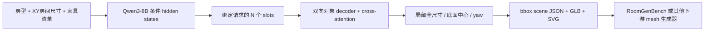

# FastFill v2：从最小条件训练到 bbox 布局

日期：2026-10-06。当前交付边界已按用户明确要求改为 **room type + room size + furniture list → layout + bbox → 下游**。不需要 FastFill 检索资产。旧丰富条件、Asset Resolver 和 Host 实现作为可选历史路径保留。

## 1. 训练和推理 pipeline

FastFill 学习 A→E。F 是确定性几何转换和序列化，不参与训练反向传播。G 可以按描述生成 mesh、装配或运行其他任务；本模型不生成 mesh/贴图。截图 `REFERENCE / Input layout` 是 RoomGenBench 的 `layout_boxes`：直接显示给定框。我们要训练模型预测这些框，再交给下游；不能把参考 GT 的彩色盒子当作模型生成效果。

上游不提供房高时保持未知，协议用固定 3 米作为竖直归一化尺度；不以目标对象高度填充输入。只知道三个字段时不假造门窗、支撑面、语义朝向或能力约束。接口、轴转换和下游兼容边界见 [直接 bbox 交付手册](fastfill-v2-direct-bbox.md)。

### 与 OptiScene 的区别

| 环节 | OptiScene 原任务 | 当前 FastFill v2 |
|---|---|---|
| 模型输入 | 房间、对象描述/数量、已检索资产 bbox | 房型、房间 XY 尺寸、家具清单；不输入对象真实 bbox |
| 模型输出 | 位置和旋转 | 目标局部全尺寸、底面中心、yaw |
| 训练 bbox | 作为生成位姿的条件 | 可靠 local size 放在 target，参与几何监督 |
| 后续 | 渲染既定资产 | 直接输出 bbox 场景；mesh 生成交给下游 |

[OptiScene §3.1、§3.3](https://arxiv.org/html/2506.07570v1#S3.SS1) 和固定数据 revision 的 [gprompt.py](https://huggingface.co/datasets/B3rrYang/3D-SynthPlace_indoor_scenes_dataset/blob/f481ff81bc2cb3e664f38ce0c25c4ad4b21d52e1/gprompt.py) 表明其 bbox 在 input，output 为 coordinates/rotate。将 bbox 移到预测端改变了任务和监督，不只是移动 JSON 字段。

最小文本改法是移除输入 bbox，在目标 JSON 增加 size；v2 文本 SFT 是这个对照。结构化主模型还更换输出架构和训练方式，不是原 OptiScene SFT/DPO 的原样复现，也没有自动 DPO 阶段。原 3D-SynthPlace 的 Y-up、bbox=[h,w,d] 与 degree 字段需要已审计的适配，不能直接作为 Z-up、局部尺寸、bottom-center/radian 标签。

[OptiScene 论文 §4.1](https://arxiv.org/html/2506.07570v1#S4.SS1) 使用 Qwen3-8B，[官方 README](https://github.com/PolySummit/OptiScene#training-pipeline) 示例则是 Qwen2.5-7B-Instruct；本实验按用户选择固定 Qwen3-8B。官方环境列 vLLM，但其 SFT/DPO 和 model.generate 推理代码未调用；当前结构化路径也不需要它，来源见 [服务器手册](fastfill-v2-server-start.md)。

## 2. 数据如何构造

原筛选的 16 个数据集家族和 review3 的 141,341 场景语料保留；它包含部分标签、丰富条件和大量未知边界。原完整 65 场景 cohort 全来自 MultiScan，不能直接冒充新的矩形 XY 房间任务。

新 `direct-bbox-20261006` 从同一已审计父语料派生，当前严格符合最小条件及可核验框标签的来源为 SpatialLM。不是重新下载原始库，也没有把其他来源缺失 yaw 补成零。资格为：已知房型/地板/矩形边界、完整局部 full size 和 bottom-center、源 ID 对应的 upright geometric yaw，以及全部目标 OBB 在已知房界内（1 mm 容差）。碰撞、支撑、mesh、physics 未认证。

| 数据 | train / validation / test | 对象总量 |
|---|---:|---:|
| 当前最小 XY 条件数据 | 9,601 / 539 / 624 | 33,545 |
| 保留的历史 review3 主数据 | 124,589 / 8,137 / 8,615 | 1,787,052 |
| 保留的历史完整标签 cohort | 57 / 2 / 6 | 572 |

继承底层 UID/房屋组/split，不重新随机划分。固定源 IR SHA256，逐个源 ID 对照局部尺寸、位置和 yaw；本次实际派生行的目标数值未改变。输入只保留房型、XY 尺寸、category 家具清单；没有固定物体、约束或支撑。源真实房高只作为 provenance/资格证据，不进入模型 condition。

每条数据仍有 condition、target、validity、provenance。模型只读 condition；实际资产 ID、目标几何和 source H 不从 provenance 注入输入。当前完整几何 masks 全有效，几何 yaw 是矩形局部轴，使用 π 周期 symmetry_order=2；不证明椅背或屏幕语义前向。当前固定对应，未重建可交换组，Hungarian=false 是明确的第一版选择。

新数据最多 26 个对象，尚不覆盖截图 32–122 对象的密集布局，也没有丰富描述标签。源审计和 hash 正确不能证明模型将会生成有效房间。私有下载与版本见 [数据手册](fastfill-v2-dataset-release.md)。

## 3. 一次 forward 联合预测什么

Qwen3-8B 使用 AutoModel 读取完整 condition、输出全部 token hidden states，不读取目标答案，也不生成 thinking 文本。每个对象 token 区间 pooling 构造 request-bound slot，并加入 slot seed；pooling 至少使用 float32 累加。外部 decoder 在所有有效 slots 间双向 self-attention，并 cross-attend 条件记忆；padding 在 attention、matching 和 loss 中屏蔽。

| head | 输出 |
|---|---|
| position | normalized XYZ bottom-center，用输入房间原点/尺度反归一化 |
| size | 正值 s_ref × exp(clamped_u)，指数 float32 计算，数值策略固定在配置 |
| yaw classification | 12 个 bin logits，初始宽度 30 度 |
| yaw residual | 每个 bin 的归一化 residual；默认 tanh |

每个请求 ID 恰好一个有效输出，不再预测类别/数量，没有 objectness、检测分类或 NMS。当前最小请求没有可信 support_parent，所以不按家具类别强制 z=0，XYZ 均接受监督。更丰富协议中直接采用的固定坐标有独立预测 mask，但不能混进当前新任务。

一次 forward 同时生成全部对象，不保证结果可行。推理之后只做确定性 bbox 转换、诊断与导出；不自动删除、缩小或挪动预测。

## 4. 每个训练 step 怎么执行

1. **取完整 batch**：schema、实际启用 loss、token/object 预算预检；超预算拒绝整场景，不截断。当前 DataLoader 内存载入、shuffle，无稀有标签平衡 sampler。
2. **forward 和对应**：当前数据固定请求身份。一般实现支持合法独立交换组内 detached position/log-size Hungarian；本数据没有这些 groups，不能声称启用集合匹配。
3. **四项 loss**：normalized position SmoothL1、log-size ratio SmoothL1、yaw-bin CE、GT-bin residual SmoothL1。先过滤无效标签再算术；loss 使用原可微张量。位置/尺寸完整向量按固定三坐标分母平均，各 head 使用自己的全局有效实例数。π 等价 yaw 候选按同一个候选的 CE+residual 联合代价选择。
4. **更新**：backward → LoRA/decoder/heads → 累积 → clip → AdamW。所有 rank 整个累积窗口没有有效 objective 时跳过更新；有监督但 loss=0 仍正常更新。日志 collective 输入统一 float32，训练张量保留梯度；validation 在 optimizer 更新后执行。
5. **保存和评测**：保存权重、tokenizer、配置、数据 hash、拒绝清单、每步 loss/计数/梯度。测试以全部请求为分母保留失败；原始预测与任何另行后处理结果分开。

训练日志 loss/count 来自累积窗口最后 microbatch，并非窗口均值；window 有效数另记录。累积为 microbatch 均值的累积，不等于不同标签密度的全对象平均。validation batch-objective 均值是诊断，完整参考指标由 evaluate 得到。

基础配置 box/collision/boundary 权重均为零；可选 box 为 BEV oriented convex-hull GIoU，不是 3D GIoU，bin argmax 不给 logits 普通梯度。collision/boundary 与 prediction-vs-GT overlap 分开。没有自动阶段切换。

文本 SFT 是同样最小条件/完整目标上的独立 assistant-token CE baseline。字符串解析后的几何误差不自动回传到 token。主方案无需文本模型预训练或 DPO。结构化按 shuffled epoch、文本每步有放回抽样，相同步数不自动等于相同样本曝光，应在正式对照冻结。

## 5. 最后得到什么

| 工件 | 用途 |
|---|---|
| model/model_config.json、geometry_model.pt | decoder、连续 heads 和配置 |
| model/backbone/ | LoRA adapter 或选定的完整骨干；LoRA/冻结骨干部署仍需同一基础 Qwen |
| tokenizer/ | 同训练的 tokenization |
| run_manifest.json、training_log.json | 数据/配置/环境/有效样本和优化证据 |
| state-step-* | 可选 Accelerate 状态；现 CLI 没有自动 optimizer resume |

部署模型生成 target_size_local_m、bottom_center_m、yaw_rad；export_handoff 再生成 bbox corners/center、RoomGenBench SceneSpec/registry、彩色 GLB、SVG 和 proxy diagnostics。不需要资产库即可显示用户截图那类框。真正家具 mesh、材质和物理可用性由下游负责，不能由 bbox 输出成功推断。

旧 catalog Resolver、actual geometry reconciliation、Validator/有限修复和 in-memory Host 未删除。它们是另一条可选系统实验，不能继续写成当前任务必须经过的阶段。

## 6. 当前训练状态与执行入口

独立 Conda、官方固定 revision Qwen3-8B 和 CUDA 已在 ssh yxd-dev 的 /home/jovyan/shanliantian 准备。基础模型路径为 models/Qwen3-8B；revision b968826d9c46dd6066d109eabc6255188de91218。用户允许 GPU 1–7，其他进程和 GPU0 保留。

历史 richer-condition MultiScan pilot：20 更新步、两个 train/两个 validation，所有 LoRA/decoder/四 head 每步收到梯度，保存加载后六个测试 schema/ID/正尺寸均通过；验证 objective 未改善，严格几何0/6主要含未知硬检查。这证明历史运行路径，不证明当前 XY 数据已训练或泛化，更不能当作密集房间生成效果。

当前最小输入的执行步骤见 [直接交付手册](fastfill-v2-direct-bbox.md) 和 [数据手册](fastfill-v2-dataset-release.md)：新数据 tokenizer 预检 → 独立 tiny smoke → 同一 Qwen3-8B 有界 pilot → 冻结曝光/预算/固定对应与合法交换组对照 → 全请求评测和下游展示。新的运行必须保存新数据 hash，输出写入新目录，不覆盖历史 review3 或旧 pilot。
